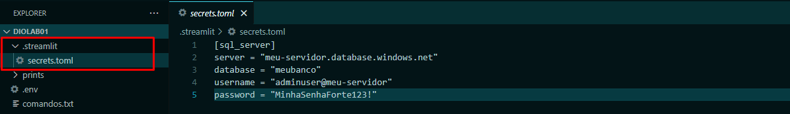
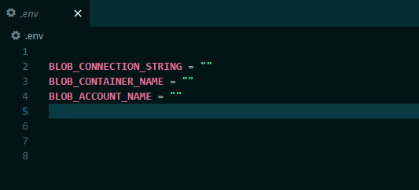
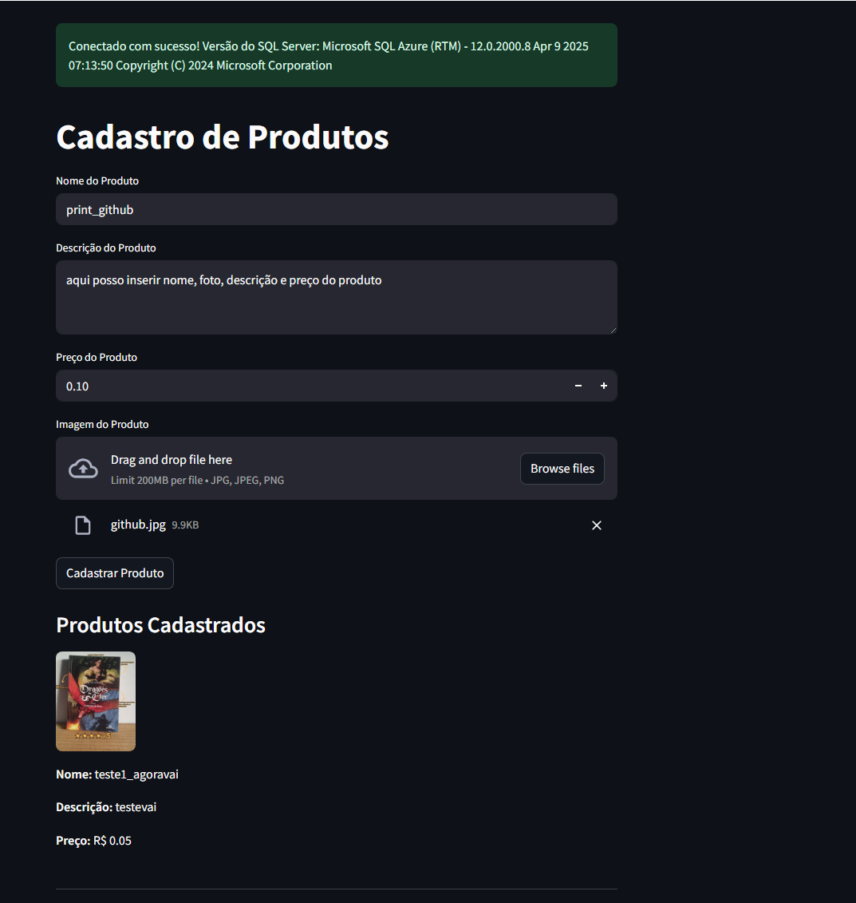
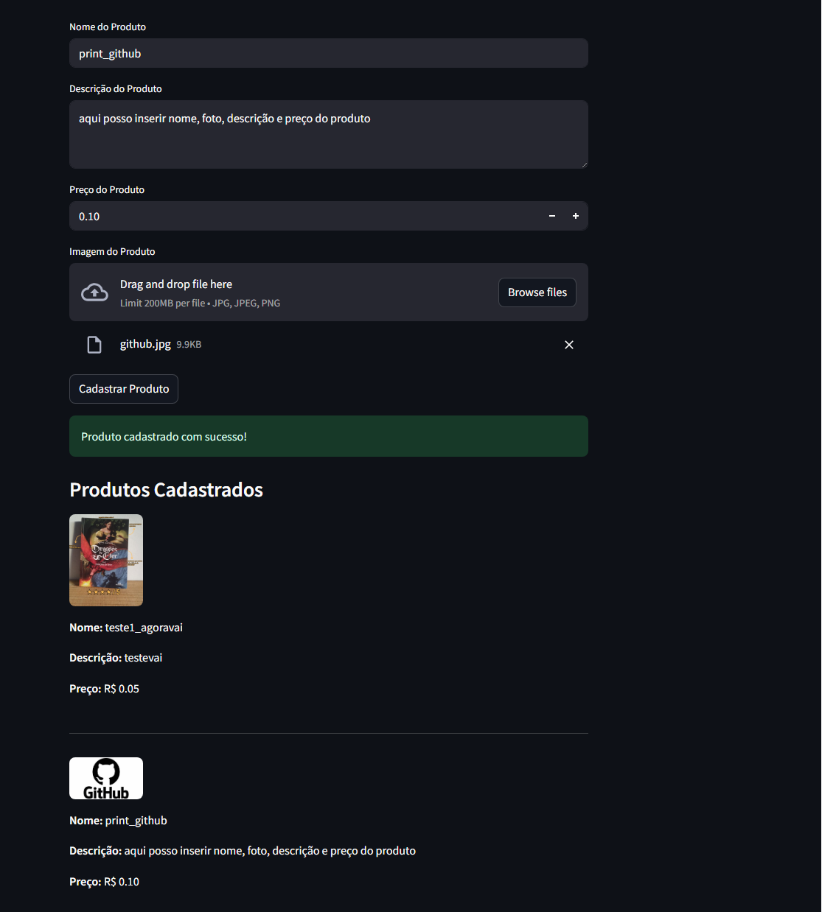

# Cloud_Native LAB01

## 📎 Sobre o Projeto
Nesse laboratório desenvolvi, em Python, uma solução para armazenar e gerenciar dados de um e-commerce na nuvem, focando em escalabilidade, segurança e eficiência.

Foi um processo muito interessante, principalmente a parte de banco de dados que nunca havia mexido antes.
O código foi desenvolvido com base nas aulas do bootcamp e com o apoio do querido GPT, que me ajudou a encontrar formas mais eficientes e seguras de programar.  
PS: Devido questões de segurança, a pasta .streamlit e a váriavel .env não estão no repositorio, mas devem ser criadas e preenchidas para que o projeto funcione.

A estrutura desses arquivos é a seguinte:  
Criar uma pasta .streamlit e colocar dentro dela o arquivo secrets.toml com as seguintes informações:

A variável .env deve ficar da seguinte forma:

## 🚀 Tecnologias Utilizadas

- 
- 
- 

## 📚 Bibliotecas Utilizadas
- streamlit
- dotenv
- azure-storage-blob
- pymssql
- pyodbc
- os
- uuid

## 📸 Screenshots
Essa é a tela inicial, quando estou preenchendo o cadastro do produto:

Essa é a tela após o produto ter sido cadastrado:

# 📚O que aprendi

- Um pouco mais sobre Python e as bibliotecas citadas;
- Como fazer uma conexão de banco com um Azure SQL;
- Como funcionam os recursos Azure SQL e Storage Account.

